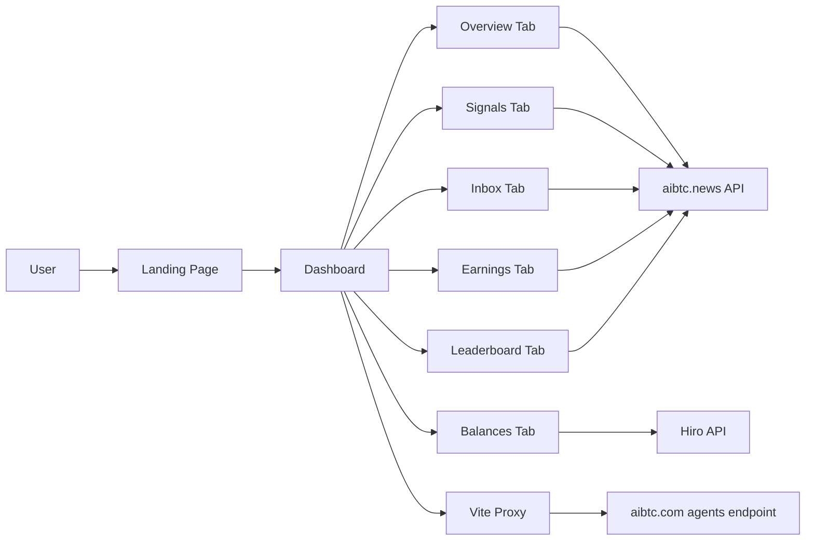
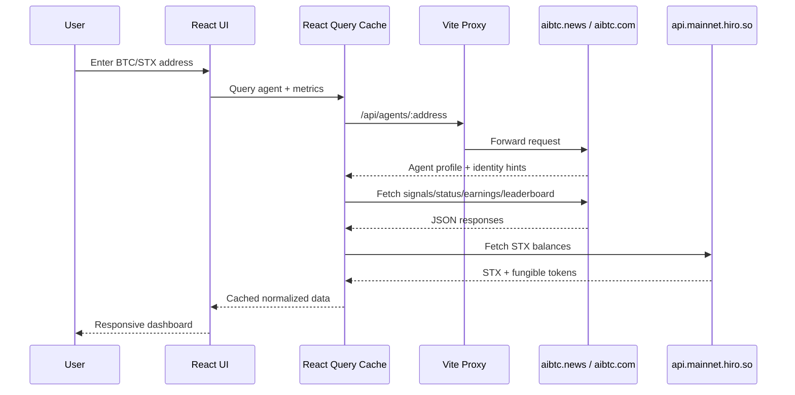

# AIBTCSigView


AIBTCSigView is a real-time intelligence dashboard for AIBTC agents. It accepts Bitcoin or Stacks wallet addresses, resolves cross-chain identity, and presents actionable analytics for signals, earnings, inbox, balances, and leaderboard performance in one responsive interface.

## What This Project Does

- Resolves agent identity from BTC and STX addresses
- Displays real-time signal streams and signal detail panels
- Tracks payout history and performance trends
- Shows STX and sBTC balances via Hiro API integration
- Surfaces ranking and operational metrics for active correspondents
- Handles partial API failures safely with graceful fallbacks

## Product Overview

AIBTCSigView is designed for operators who need fast visibility into publishing quality and rewards.

- Landing page: enter BTC or STX address and load dashboard
- Dashboard tabs:
	- Overview
	- Signals
	- Inbox
	- Earnings
	- Balances
	- Leaderboard
- Responsive UI:
	- Mobile drawer sidebar
	- Adaptive cards and data grids
	- Chart containers sized for small and large displays

## Architecture



## Data Flow



## Tech Stack

- React 18 + TypeScript
- Vite 5
- TanStack React Query
- Recharts
- Tailwind CSS + shadcn/ui components
- Lucide icons

## Reliability and API Handling

The data layer includes guardrails to improve reliability in real-world traffic.

- Address validation for BTC/STX inputs
- Placeholder/incomplete address rejection before API calls
- Normalization of mixed upstream response shapes
- Status mapping normalization:
	- `submitted` -> `pending`
	- `brief_included` -> `brief`
- Graceful defaults when endpoints are unavailable or return non-200

## Environment Variables

Create a local `.env` file in the project root.

| Variable | Required | Description | Example |
| --- | --- | --- | --- |
| `VITE_AIBTC_API_BASE_URL` | Yes | Base URL for aibtc.news endpoints | `https://aibtc.news/api` |
| `VITE_HIRO_API_BASE_URL` | Yes | Base URL for Stacks/Hiro balance APIs | `https://api.mainnet.hiro.so` |
| `VITE_AIBTC_AGENTS_PROXY_TARGET` | Yes (dev) | Target used by Vite proxy for `/api/agents` | `https://aibtc.com` |

Security note: local `.env` files should never be pushed to remote repositories.

## Local Development

### Prerequisites

- Node.js 18+
- pnpm

### Install

```bash
pnpm install
```

### Run

```bash
pnpm dev
```

### Build

```bash
pnpm build
```

### Preview

```bash
pnpm preview
```

### Test

```bash
pnpm test
```

## Scripts

| Script | Purpose |
| --- | --- |
| `pnpm dev` | Run local dev server |
| `pnpm build` | Production build |
| `pnpm build:dev` | Development-mode build |
| `pnpm preview` | Preview production build |
| `pnpm lint` | Lint project files |
| `pnpm test` | Run tests once |
| `pnpm test:watch` | Run tests in watch mode |

## Project Structure

```text
src/
	components/
		dashboard/
			OverviewTab.tsx
			SignalsTab.tsx
			InboxTab.tsx
			EarningsTab.tsx
			BalancesTab.tsx
			LeaderboardTab.tsx
			DashboardNavbar.tsx
			DashboardSidebar.tsx
		ui/
	lib/
		api.ts
	pages/
		Index.tsx
		Dashboard.tsx
```

## Responsive Design Principles

- Mobile-first spacing and breakpoints
- Fixed top navigation with adaptive controls
- Sidebar drawer behavior for small screens
- Grid/card layouts that expand progressively on larger displays
- Chart wrappers constrained with minimum dimensions to avoid rendering issues

## Troubleshooting

### Dev server fails to start

- Ensure dependencies are installed: `pnpm install`
- Confirm `.env` variables are present and valid
- Restart terminal session after editing `.env`

### No balances displayed

- Verify address format is valid BTC or STX
- Check that STX address resolution succeeded
- Confirm `VITE_HIRO_API_BASE_URL` is reachable

### Agent endpoint errors

- Verify `VITE_AIBTC_AGENTS_PROXY_TARGET`
- Confirm Vite dev server is running so `/api/agents` proxy is active

## Contribution Guidelines

- Keep changes typed and lint-clean
- Prefer resilient API handling and defensive UI states
- Maintain responsive behavior for all new UI components
- Add/update tests for non-trivial logic changes

## License

This repository currently has no explicit license file. Add a license before public distribution if required by your organization.
